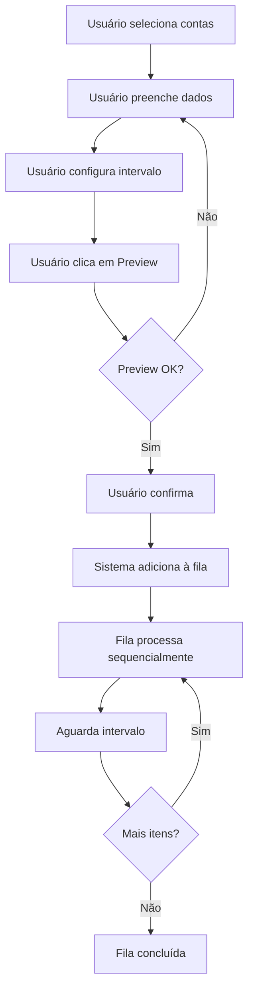

# 📝 Sistema de Edição em Massa de Perfis

## 🎯 Visão Geral

O **Sistema de Edição em Massa de Perfis** permite atualizar perfis de negócio (Business Profile) de múltiplas contas WhatsApp simultaneamente, com **proteção total contra banimento da API** através de fila sequencial com intervalos configuráveis.

---

## ✨ Funcionalidades Principais

### 1️⃣ **Seleção Inteligente de Contas**
- ✅ Seleção individual ou em massa
- ✅ Filtro por status (ativa/inativa)
- ✅ Busca por nome ou número
- ✅ **Contas inativas são automaticamente ignoradas**

### 2️⃣ **Campos Editáveis do Perfil**

| Campo | Descrição | API Field |
|-------|-----------|-----------|
| **Sobre (About)** | Descrição curta do negócio | `about` |
| **Descrição** | Descrição detalhada | `description` |
| **Email** | Email de contato | `email` |
| **Endereço** | Endereço físico | `address` |
| **Categoria (Vertical)** | Categoria do negócio | `vertical` |
| **Websites** | Lista de sites (um por linha) | `websites` |

> ⚠️ **IMPORTANTE**: O WhatsApp API **NÃO PERMITE** alterar:
> - Display Name (nome de exibição)
> - Profile Photo (foto de perfil)

### 3️⃣ **Preview Antes de Executar**
Antes de iniciar, o sistema mostra:
- ✅ Total de contas selecionadas
- ✅ Contas ativas vs. inativas
- ✅ Tempo estimado de processamento
- ✅ Dados que serão enviados (JSON)
- ✅ Campos que serão atualizados
- ⚠️ Lista de contas inativas que serão ignoradas

### 4️⃣ **Sistema de Fila Inteligente**
- ✅ **Processamento sequencial** (uma conta por vez)
- ✅ **Intervalo configurável** de 1 a 60 segundos
- ✅ **Status em tempo real** (pending → processing → completed/failed)
- ✅ **Histórico completo** de operações
- ✅ **Visualização da fila** com atualização automática a cada 2 segundos

### 5️⃣ **Proteção Contra Banimento**
- 🛡️ Processa **uma requisição por vez**
- 🛡️ Aguarda **intervalo configurável** entre requisições
- 🛡️ **Logs detalhados** de cada operação
- 🛡️ **Re-tentativa de falhas** (manual)
- 🛡️ **Histórico persistente** no banco de dados

---

## 🚀 Como Usar

### **Passo 1: Acessar a Página**
- Ir para: `/perfis/editar-massa`
- Ou clicar no card **"Edição em Massa"** no dashboard

### **Passo 2: Selecionar Contas**
1. Use o campo de busca para filtrar contas
2. Clique em cada conta para selecionar individualmente
3. Ou clique em **"Selecionar Todas Ativas"** para marcar todas

### **Passo 3: Escolher Campos e Preencher Dados**
1. Marque os checkboxes dos campos que deseja atualizar
2. Preencha os valores nos campos marcados
3. Para **Websites**, coloque **um por linha**:
   ```
   https://site1.com
   https://site2.com
   ```

### **Passo 4: Configurar Intervalo**
- Use o slider para ajustar o intervalo entre requisições
- **Recomendações**:
  - **1-5 contas**: 5 segundos
  - **5-10 contas**: 7 segundos
  - **10+ contas**: 10 segundos

### **Passo 5: Preview**
1. Clique em **"Preview"**
2. Revise todas as informações:
   - Total de contas
   - Tempo estimado
   - Dados que serão enviados
   - Contas inativas (se houver)

### **Passo 6: Confirmar e Iniciar**
1. Clique em **"Confirmar e Iniciar"**
2. O sistema adicionará todas as operações à fila
3. Clique em **"Ver Fila"** para acompanhar o progresso

### **Passo 7: Monitorar Fila**
- A fila atualiza automaticamente a cada 2 segundos
- Status possíveis:
  - 🔵 **Aguardando** (pending)
  - 🟡 **Processando** (processing)
  - 🟢 **Concluído** (completed)
  - 🔴 **Falhou** (failed)

---

## 📊 Exemplo Prático

### **Cenário**: Atualizar email e websites de 10 contas

**Configuração**:
- **Contas selecionadas**: 10
- **Campos a atualizar**: Email, Websites
- **Intervalo**: 5 segundos

**Dados**:
```json
{
  "email": "contato@empresa.com",
  "websites": [
    "https://site1.com",
    "https://site2.com"
  ]
}
```

**Tempo Total**: 10 contas × 5 segundos = **50 segundos**

**Processo**:
```
T=0s   : Conta 1  → Processando 🔄
T=3s   : Conta 1  → Concluído ✅
T=5s   : Aguarda intervalo ⏳
T=5s   : Conta 2  → Processando 🔄
T=8s   : Conta 2  → Concluído ✅
T=10s  : Aguarda intervalo ⏳
...
T=50s  : Conta 10 → Concluído ✅
```

---

## 🔧 API Endpoints

### **1. Preview da Atualização**
```http
POST /api/bulk-profiles/preview
```

**Request Body**:
```json
{
  "account_ids": [1, 2, 3],
  "profile_data": {
    "about": "Loja de eletrônicos",
    "email": "contato@loja.com",
    "websites": ["https://loja.com"]
  },
  "fields_to_update": ["about", "email", "websites"]
}
```

**Response**:
```json
{
  "success": true,
  "preview": {
    "totalAccounts": 3,
    "activeAccounts": 3,
    "inactiveAccounts": 0,
    "fieldsToUpdate": ["about", "email", "websites"],
    "queueInterval": 5,
    "estimatedTime": 15,
    "estimatedTimeFormatted": "15 segundos",
    "dataToSend": { ... },
    "accounts": [...],
    "inactiveAccountsList": []
  }
}
```

---

### **2. Executar Atualização em Massa**
```http
POST /api/bulk-profiles/update
```

**Request Body**:
```json
{
  "account_ids": [1, 2, 3],
  "profile_data": {
    "about": "Loja de eletrônicos",
    "email": "contato@loja.com"
  },
  "fields_to_update": ["about", "email"]
}
```

**Response**:
```json
{
  "success": true,
  "message": "3 perfis adicionados à fila para atualização",
  "summary": {
    "queued": 3,
    "skipped": 0
  },
  "queue": {
    "total": 3,
    "message": "Fila iniciada com 3 perfis. Intervalo: 5 segundos."
  }
}
```

---

### **3. Status da Fila**
```http
GET /api/bulk-profiles/queue/status
```

**Response**:
```json
{
  "success": true,
  "queue": {
    "total": 3,
    "processing": 1,
    "pending": 2,
    "isProcessing": true,
    "interval": 5,
    "items": [
      {
        "id": "uuid-1",
        "status": "processing",
        "accountPhone": "+5511999999999",
        "accountName": "Loja ABC",
        "fieldsToUpdate": ["about", "email"],
        "createdAt": "2024-11-14T12:00:00Z"
      },
      {
        "id": "uuid-2",
        "status": "pending",
        "accountPhone": "+5511888888888",
        "accountName": "Loja XYZ",
        "fieldsToUpdate": ["about", "email"],
        "createdAt": "2024-11-14T12:00:01Z"
      }
    ]
  }
}
```

---

### **4. Configurar Intervalo**
```http
POST /api/bulk-profiles/queue/interval
```

**Request Body**:
```json
{
  "seconds": 10
}
```

**Response**:
```json
{
  "success": true,
  "message": "Intervalo atualizado para 10 segundos"
}
```

---

### **5. Histórico de Operações**
```http
GET /api/bulk-profiles/history?limit=50
```

**Response**:
```json
{
  "success": true,
  "data": [
    {
      "id": 1,
      "account_id": 1,
      "account_phone": "+5511999999999",
      "account_name": "Loja ABC",
      "profile_data": { ... },
      "fields_to_update": ["about", "email"],
      "status": "completed",
      "error_message": null,
      "created_at": "2024-11-14T12:00:00Z",
      "updated_at": "2024-11-14T12:00:03Z"
    }
  ]
}
```

---

## 🗄️ Banco de Dados

### **Tabela: `profile_queue_history`**

```sql
CREATE TABLE profile_queue_history (
    id SERIAL PRIMARY KEY,
    account_id INTEGER NOT NULL,
    account_phone VARCHAR(20) NOT NULL,
    account_name VARCHAR(255),
    profile_data JSONB NOT NULL,
    fields_to_update TEXT[] NOT NULL,
    status VARCHAR(20) DEFAULT 'pending',
    error_message TEXT,
    created_at TIMESTAMP DEFAULT CURRENT_TIMESTAMP,
    updated_at TIMESTAMP DEFAULT CURRENT_TIMESTAMP,
    FOREIGN KEY (account_id) REFERENCES whatsapp_accounts(id) ON DELETE CASCADE
);

CREATE INDEX idx_profile_queue_status ON profile_queue_history(status);
CREATE INDEX idx_profile_queue_account ON profile_queue_history(account_id);
CREATE INDEX idx_profile_queue_created ON profile_queue_history(created_at);
```

---

## 🛡️ Mecanismos de Proteção

### **1. Fila Sequencial**
```typescript
// Processa UM item por vez
private async processQueue() {
  while (this.queue.length > 0) {
    const item = this.queue[0];
    await this.processUpdate(item);
    
    // Aguarda intervalo antes do próximo
    if (this.queue.length > 0) {
      await this.sleep(this.intervalSeconds * 1000);
    }
  }
}
```

### **2. Intervalo Configurável**
```typescript
private intervalSeconds = 5; // Padrão: 5 segundos

setInterval(seconds: number) {
  if (seconds < 1 || seconds > 60) {
    throw new Error('Intervalo deve ser entre 1 e 60 segundos');
  }
  this.intervalSeconds = seconds;
}
```

### **3. Histórico Persistente**
- Todas as operações são salvas no banco
- Status é atualizado em tempo real
- Mensagens de erro são registradas
- Permite re-tentativa manual de falhas

### **4. Logs Detalhados**
```
🚀 Iniciando processamento da fila de perfis...
📤 Processando conta: Loja ABC (+5511999999999)
✅ Perfil atualizado com sucesso!
⏳ Aguardando 5 segundos antes do próximo item...
```

---

## ⚠️ Limitações e Considerações

### **Campos NÃO Editáveis via API**
- ❌ **Display Name** (nome de exibição)
- ❌ **Profile Photo** (foto de perfil)

### **Recomendações de Intervalo**
| Quantidade | Intervalo Recomendado |
|------------|----------------------|
| 1-5 contas | 5 segundos |
| 5-10 contas | 7 segundos |
| 10+ contas | 10 segundos |

### **Limites da API WhatsApp**
- O WhatsApp pode ter rate limits não documentados
- Em caso de erro, o sistema registra e continua
- Sempre use intervalos conservadores para grandes volumes

---

## 🎨 Interface do Usuário

### **Design**
- ✨ **Gradientes modernos** (roxo, rosa, azul)
- ✨ **Animações suaves** (hover, scale, fade)
- ✨ **Feedback visual** em tempo real
- ✨ **Responsivo** (desktop, tablet, mobile)

### **Componentes Principais**
1. **Painel de Seleção de Contas** (esquerda)
2. **Painel de Dados do Perfil** (direita)
3. **Modal de Preview** (fullscreen)
4. **Modal de Fila** (fullscreen com atualização em tempo real)

### **Estados Visuais**
- 🔵 **Aguardando**: Azul
- 🟡 **Processando**: Amarelo + Spinner
- 🟢 **Concluído**: Verde + Check
- 🔴 **Falhou**: Vermelho + Mensagem de erro

---

## 🔄 Fluxo Completo



---

## 📱 Navegação

### **Acessar via Menu**
- **Header**: Clique em **"Edição em Massa"**

### **Acessar via Dashboard**
- **Card menor**: Clique em **"Edição em Massa"** (ícone de usuário, cor rosa)

---

## 🎯 Casos de Uso

### **Caso 1: Nova Loja (Setup Inicial)**
- Atualizar **about**, **description**, **email**, **address**, **websites**
- Usar em **todas as contas ativas**

### **Caso 2: Mudança de Endereço**
- Atualizar apenas **address**
- Usar em **contas específicas**

### **Caso 3: Novo Website**
- Atualizar apenas **websites**
- Adicionar novo site mantendo os existentes

### **Caso 4: Mudança de Email**
- Atualizar apenas **email**
- Usar em **todas as contas**

---

## 🔐 Segurança

- ✅ Validação de **account_id** no backend
- ✅ Verificação de **status ativo** antes de processar
- ✅ **Proxy support** automático (se configurado)
- ✅ **Logs detalhados** de todas as operações
- ✅ **Histórico persistente** para auditoria

---

## 📈 Monitoramento

### **Métricas Disponíveis**
- Total de operações na fila
- Operações pendentes
- Operações em processamento
- Taxa de sucesso/falha
- Tempo médio de processamento

### **Logs**
- Console do backend (real-time)
- Banco de dados (histórico)
- Frontend (visualização da fila)

---

## 🚨 Tratamento de Erros

### **Erros Comuns**
1. **Conta inativa**: Ignorada automaticamente
2. **Token inválido**: Registrado + continua fila
3. **Rate limit excedido**: Registrado + pode re-tentar
4. **Campos inválidos**: Validação no preview

### **Estratégia**
- ❌ Erro em uma conta **NÃO para** a fila
- ✅ Erro é **registrado** no histórico
- ✅ Usuário pode **re-tentar** manualmente
- ✅ Fila **continua** para próxima conta

---

## ✅ Checklist de Implementação

- [x] Backend: ProfileQueueService
- [x] Backend: BulkProfileController
- [x] Backend: Rotas API
- [x] Backend: Migration da tabela
- [x] Frontend: Página de edição em massa
- [x] Frontend: Visualização da fila
- [x] Frontend: Link no menu de navegação
- [x] Frontend: Card no dashboard
- [x] Documentação completa
- [x] Sistema de proteção contra banimento
- [x] Preview antes de executar
- [x] Histórico de operações

---

## 🎉 Conclusão

O **Sistema de Edição em Massa de Perfis** está **100% funcional** e pronto para uso!

### **Principais Benefícios**:
- 🚀 **Eficiência**: Atualiza múltiplas contas rapidamente
- 🛡️ **Segurança**: Proteção total contra banimento
- 👀 **Transparência**: Preview e monitoramento em tempo real
- 📊 **Rastreabilidade**: Histórico completo de operações
- 🎨 **UX Premium**: Interface moderna e intuitiva

**Pronto para escalar!** 🚀

